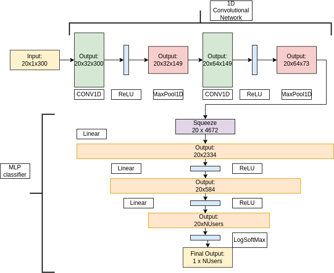

# ABSTRACT:
This thesis explores the innovative domain of cancelable biometric systems with a focus on electrocardiogram (ECG) signals for secure and reliable user identification. The motivation stems from the increasing prevalence of biometric systems in everyday applications and the associated privacy concerns, exemplified by recent controversies such as the WorldCoin project. Cancelable biometrics, which intentionally distort biometric features to protect user data, offer a promising solution.

The research begins with an overview of biometric systems' security and privacy challenges, highlighting the potential of ECG signals due to their physiological stability and individual uniqueness. A novel approach integrating deep learning techniques with ECG-based cancelable templates was developed. This approach was rigorously tested and demonstrated to meet essential cancelable requirements, with performance comparable to the state-of-the-art.

Key contributions include a simple yet effective template issuing method that leverages interdisciplinary knowledge from biomedical engineering, signal processing, and deep learning. The results emphasize the feasibility of ECG-based cancelable biometric systems, underscoring their potential for scalable and user-friendly applications.

The broader implications of this research are significant, addressing critical challenges in biometric security and paving the way for future developments. The findings advocate for the integration of smart wearables and IoT devices in our daily lives, enhancing convenience and security in everyday authentication processes. Future research directions include improving system robustness and exploring the fusion of multiple biometric modalities to further advance the field.

## USE:

Download the ECG_ID_dataset and set it at the same level as src. 
Download the required packages and use main.py editing the needed global variables.
